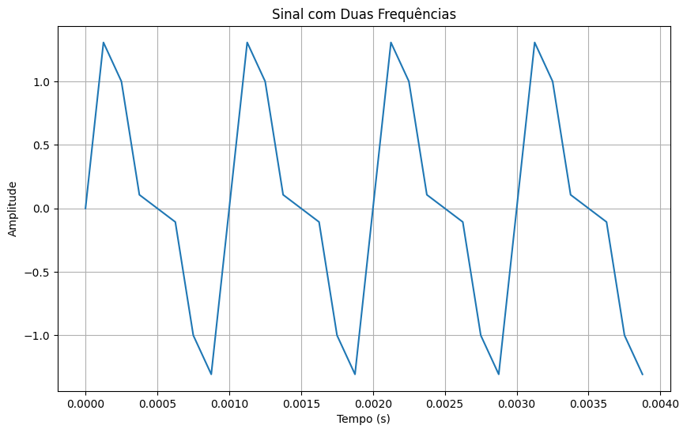
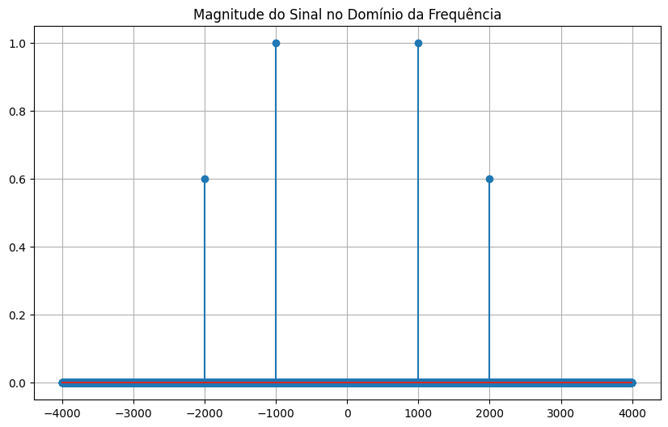
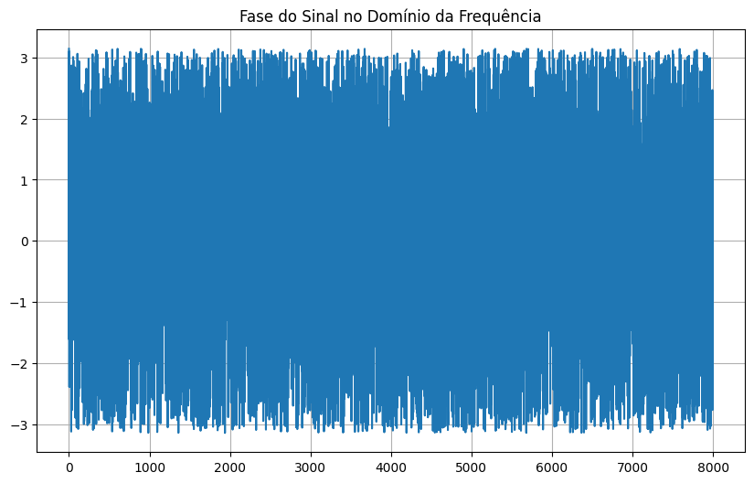
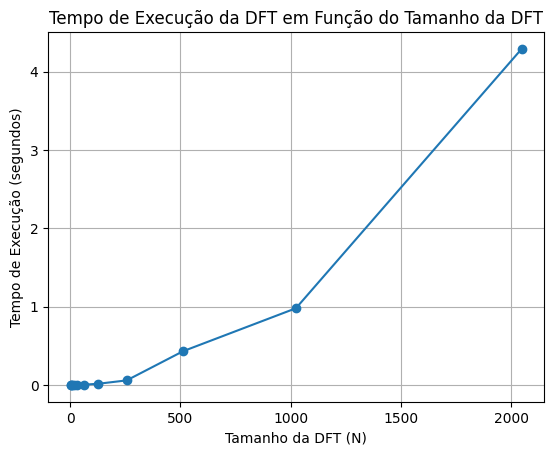

# DFT - Report
- Discrete Fourier Transform - PDS class
- Federal University of Campina Grande
- Hortencia Diniz Dultra e Silva - 05/10/23

In this case, a graph was requested that related the DTF size with your execution time.

The Colaboratory was used to run the code made in python.

# Build e Execução
1. As bibliotecas 'numpy' e 'matplotlib.pyplot' para realizar cálculos e plotagem, respectivamente;

2. Foi feito um teste para saber se o numero digitado estava em potência de dois, caso contrário, use o método "Zero Pad";

3. Dois arrays são criados e preenchidos com sequencias pares e impares do sinal

4. A frequência de amostragem "fs" foi definida como 8KHz, que é a taxa de amostragem do sinal;

5. Foi criado um vetor de tempo t usando 'np.arange' que varia de 0 a 1 segundo com uma taxa de amostragem de 1/fs. Isso cria um vetor de tempo com pontos igualmente espaçados.

6. Foram definidas as frequências f1 e f2 como 1KHz e 2KHz, respectivamente, que são as frequências das duas senoides que compõem o sinal de entrada.

7. A plotagem foi limitada para mostrar apenas os primeiros 0.004 segundos (4 períodos) do sinal.

8. Por fim, fiz a IDFT - Inverse Discret Fourier Transform - para saber se o sinal reconstruído a partir da frequência gerava o sinal de entrada.

# Exemplo de resultado

com um sinal x(t) de entrada descrito por:

$$x(t) = \sin(2 \pi 1000 t) + 0.6 \cdot \sin(2 \pi 2000 t)$$

O resultado da operação de DFT é mostrado a seguir e, como esperado, a transformada de cada seno são dois impulsos, cada uma na sua respectiva frequência e amplitude pré-determinadas.

O gráfico que relaciona o tempo em relação ao tamanho da DFT é:

**Nota:** O código ainda requer testes para outros sinais de entrada.

**Livro de apoio: Rychard G. Lyons, Understanding Digital
Signal Processing, Third Edition, Chapter Three, The Discrete
Fourier Transform**
